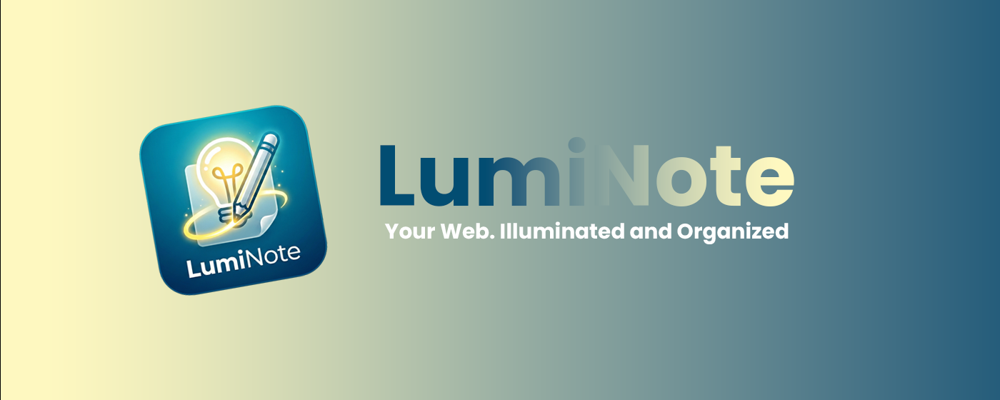
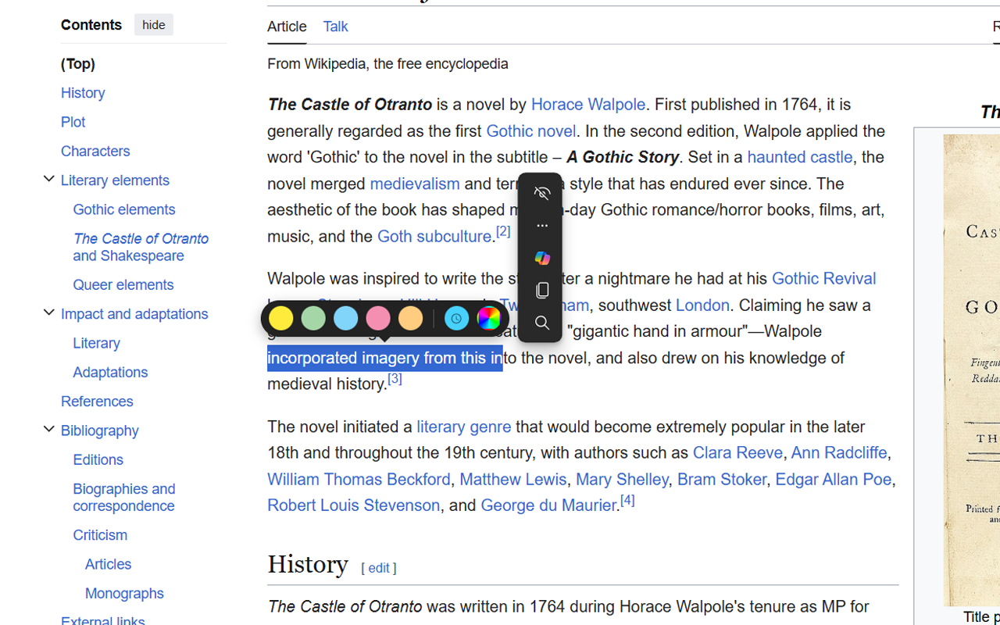
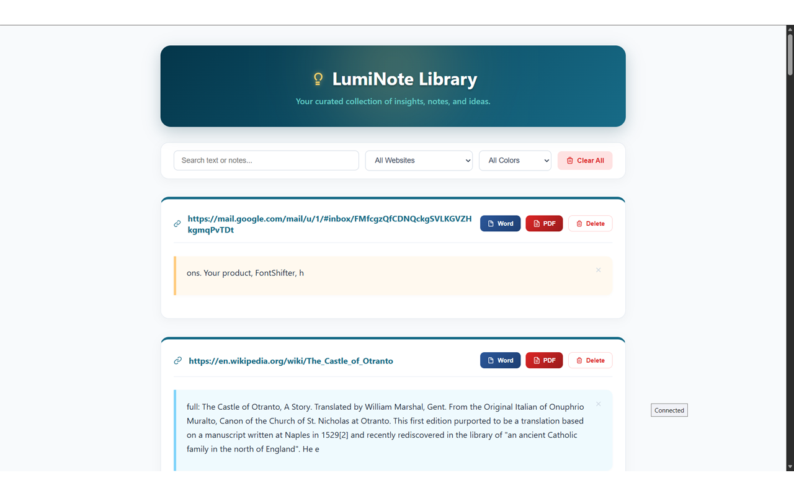

<div align="center">



# LumiNote

**Your Web. Illuminated and Organized.**

Highlight text, draw on webpages, attach notes, and export your curated research to Word or PDF — all from a lightweight browser extension.

[](https://microsoftedge.microsoft.com/addons/detail/luminote/icfniiligafjcfkomejlehlkdhbihbcg)


**English** · [فارسی](README.fa.md)

</div>

---

## ✨ Overview

**LumiNote** turns any webpage into an interactive research canvas. Select text to highlight it in a color of your choice, pin a written note or a hand-drawn sketch to that highlight, and revisit everything later in a clean dashboard. When you're ready to share or archive, export a page's highlights to **Word** or **PDF** in a single click.

Everything is stored **locally** in your browser — no accounts, no servers, no tracking.

## 🚀 Features

- 🖍️ **Multi-color highlighting** — Pick from five preset colors (Yellow, Green, Blue, Pink, Orange) or choose any **custom color** with the built-in color picker. Your last custom color is remembered for quick reuse.
- 📝 **Notes on highlights** — Attach a written note to any highlight and read it back on hover.
- ✏️ **Drawing & handwriting** — Sketch directly onto a multi-page canvas with a pen, eraser, and stroke eraser. Drawings are saved as editable vector strokes, so you can come back and refine them.
- 💾 **Persistent highlights** — Highlights are re-anchored to the page using DOM paths, so they reappear automatically the next time you visit.
- 📚 **The LumiNote Library** — A dedicated dashboard listing every highlight, grouped by website, with **live search**, **filter by domain**, and **filter by color**.
- 📄 **Export to Word & PDF** — Export a page's highlights (including notes and drawings) to a `.doc` file or a print-ready PDF.
- 🧹 **Easy cleanup** — Clear highlights for the current page, delete a single highlight, or reset everything.

## 📸 Screenshots

| Highlight & annotate any page | The LumiNote Library |
| :---: | :---: |
|  |  |

## 📦 Installation

### From the Microsoft Edge Add-ons store (recommended)

Install LumiNote directly from the official store:

👉 **[LumiNote on Microsoft Edge Add-ons](https://microsoftedge.microsoft.com/addons/detail/luminote/icfniiligafjcfkomejlehlkdhbihbcg)**

### Load unpacked (for development)

1. Download the latest release from [here](https://github.com/DivSlayer/LumiNote/releases/latest) and extract the `.zip`.
2. Open your browser's extensions page:
   - Edge: `edge://extensions`
   - Chrome: `chrome://extensions`
3. Enable **Developer mode**.
4. Click **Load unpacked** and select the project folder.

## 🖱️ How to Use

1. **Highlight** — Select any text on a webpage. A color palette appears above your selection; click a color to highlight.
2. **Annotate** — Hover over a highlight and click the ✏️ pencil to open the note popup. Type a note and/or open the drawing canvas to sketch.
3. **Manage** — Hover over a highlight to reveal the action menu (edit note / delete).
4. **Review** — Click the LumiNote toolbar icon and choose **View All Highlights** to open the Library.
5. **Export** — In the Library, use the **Word** or **PDF** buttons on any site card to export its highlights.

## 🗂️ Project Structure

```
Highlighter/
├── manifest.json      # Manifest V3 configuration
├── content.js         # Core: highlighting, notes, drawing canvas, DOM anchoring
├── styles.css         # Styles for the injected in-page UI
├── popup.html/js      # Toolbar popup (View library, clear page, reset all)
├── highlights.html/js # The LumiNote Library dashboard + Word/PDF export
├── icons/             # Extension icons (16/32/48/128)
└── promote.png        # Promotional banner
```

## 🔒 Permissions & Privacy

LumiNote requests only what it needs:

- **`storage`** — Save your highlights, notes, and drawings locally in the browser.
- **`activeTab`** — Apply and clear highlights on the page you're viewing.

All data stays on your device. LumiNote does not collect, transmit, or share any of your information.

## 🛠️ Tech Stack

- **Manifest V3** browser extension
- Vanilla **JavaScript**, **HTML**, and **CSS** — no frameworks, no dependencies
- **`chrome.storage.local`** for persistence
- HTML Canvas for drawing; MHTML for Word export; the browser print pipeline for PDF export

## 📄 License

This project is provided as-is. See the repository for details.

---

<div align="center">

Made with 💛 — <em>Quick Notes, Illuminated Insights.</em>

</div>
